# FoodLabs-ROS-Startup-Competition

## For the Final Report of the project check the pdf:
[Final Project PDF](https://github.com/teetangh/Kaustav-FoodLabs-ROS-Startup-Competition/blob/master/Resources/Final%20Report.pdf)

### Here are some highlights of the Project:

# Full Building Side View
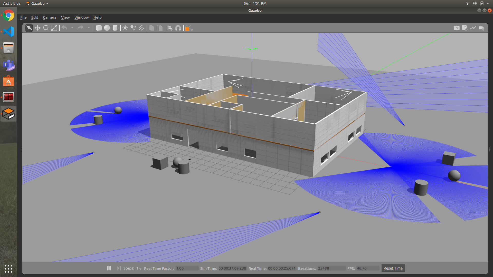

# Full Building Top View
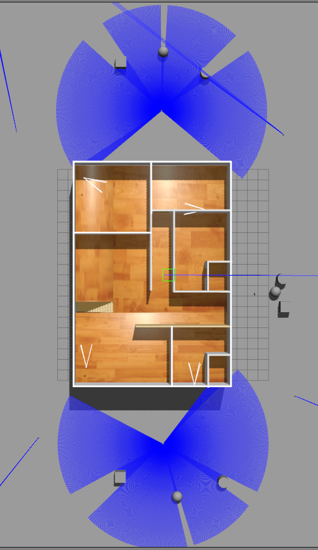

# Kinect Sensor 
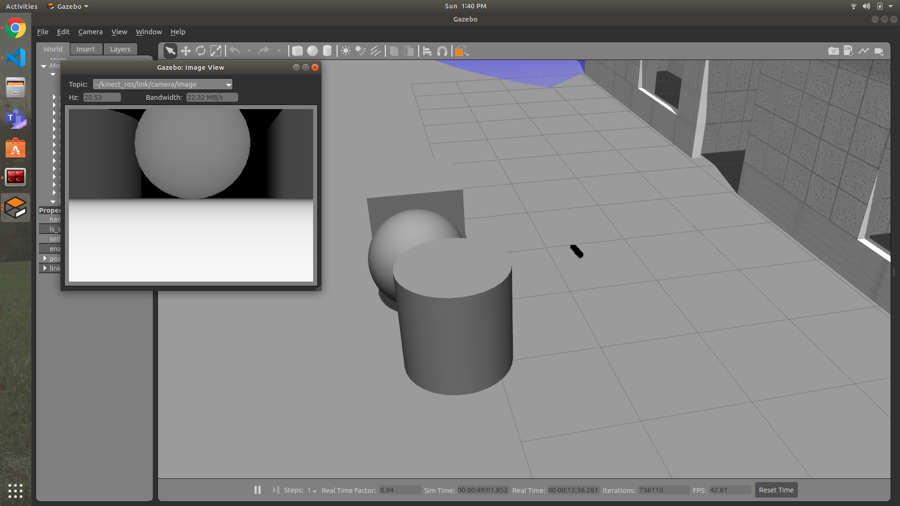

# Velodyne (Self Crafted)
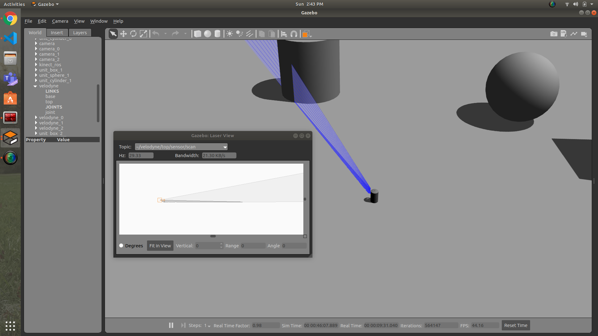

# Camera 1
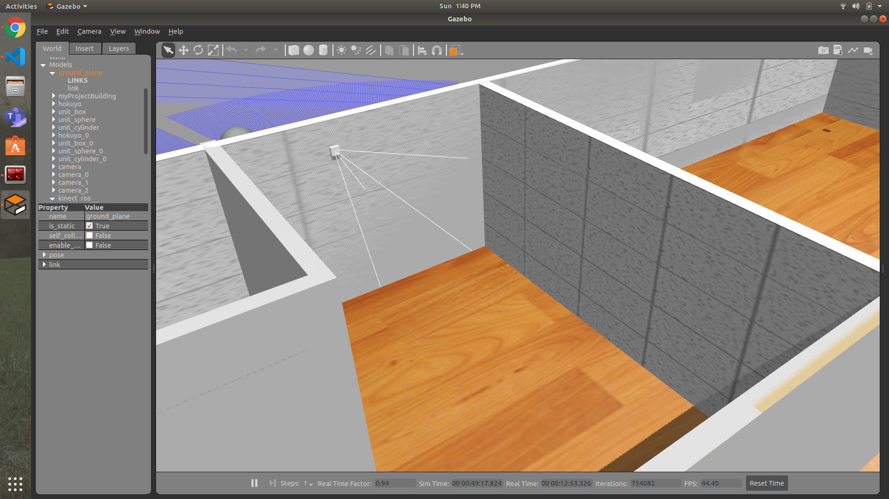
# Camera 2
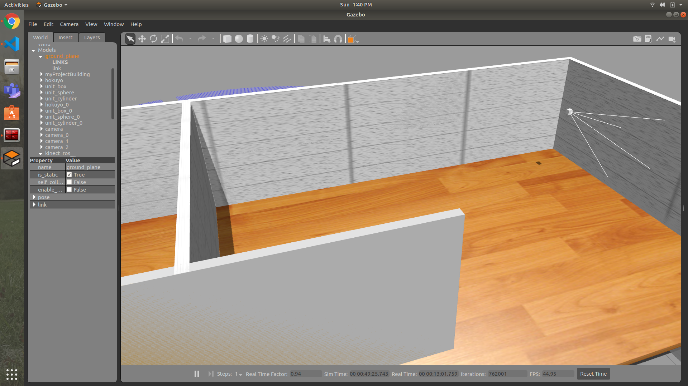
# Camera 3
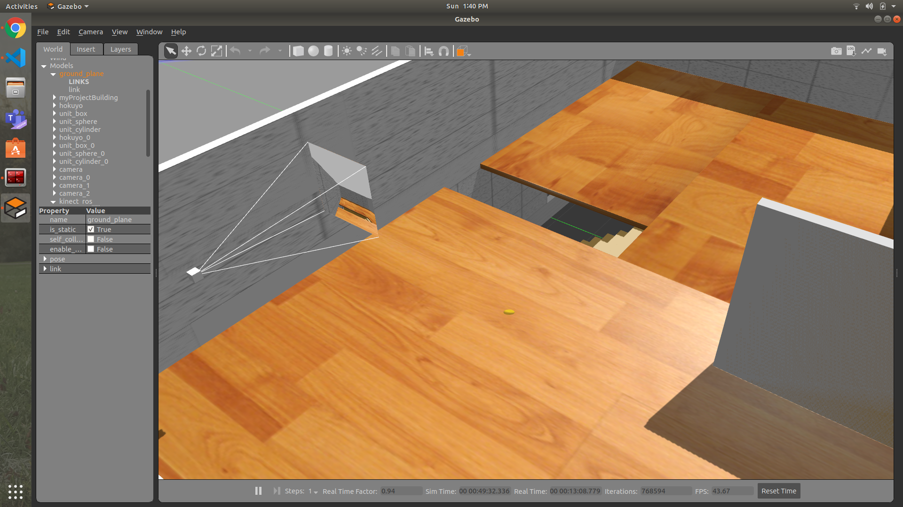
# Camera 4
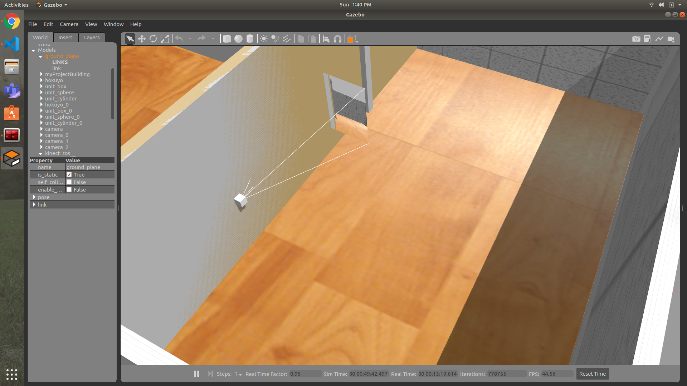
# Camera 5
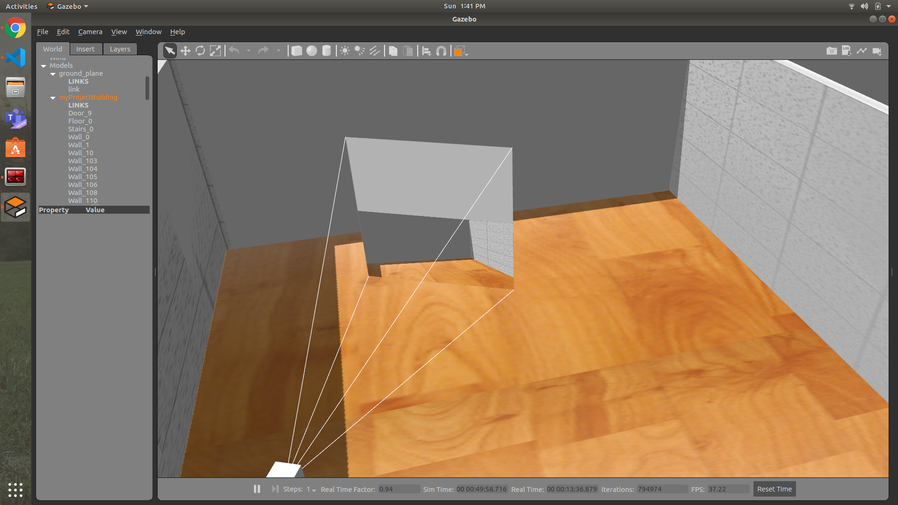

# Hokuyo Laser Scanner Perspective 1
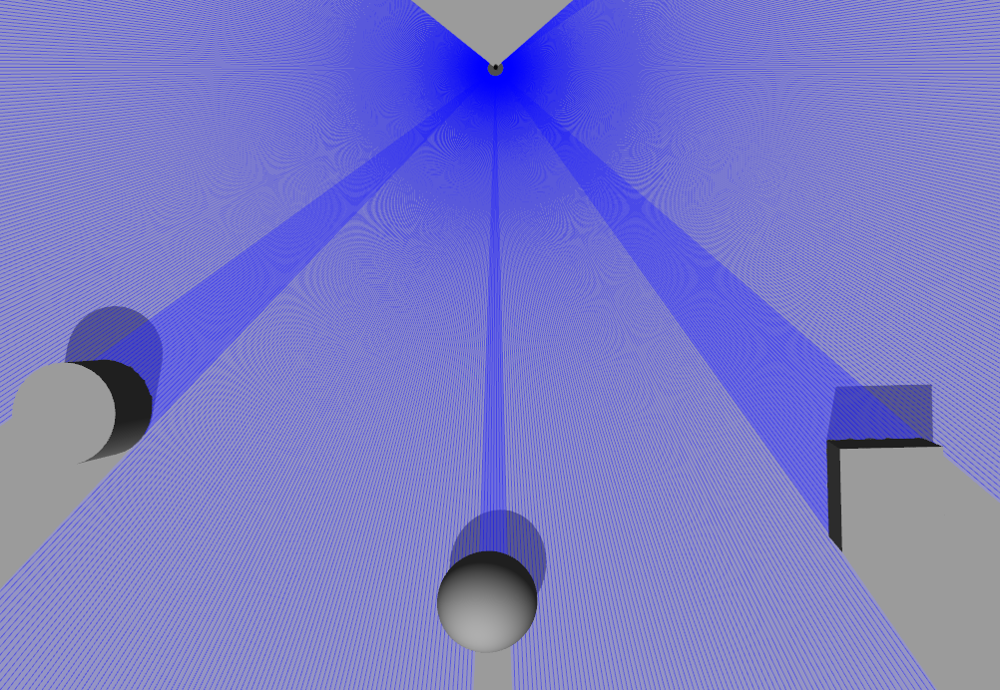
# Hokuyo Laser Scanner Perspective 2
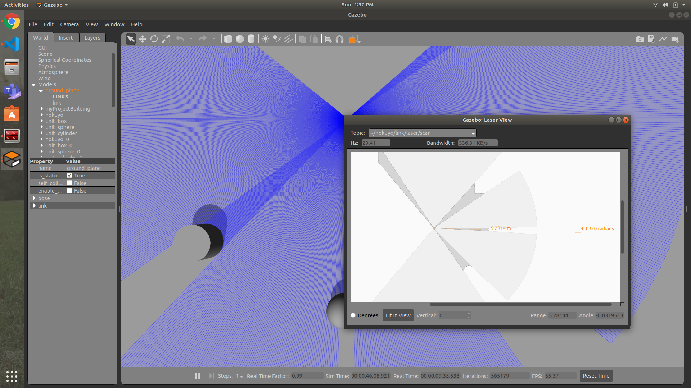
# Hokuyo Laser Scanner Perspective 3
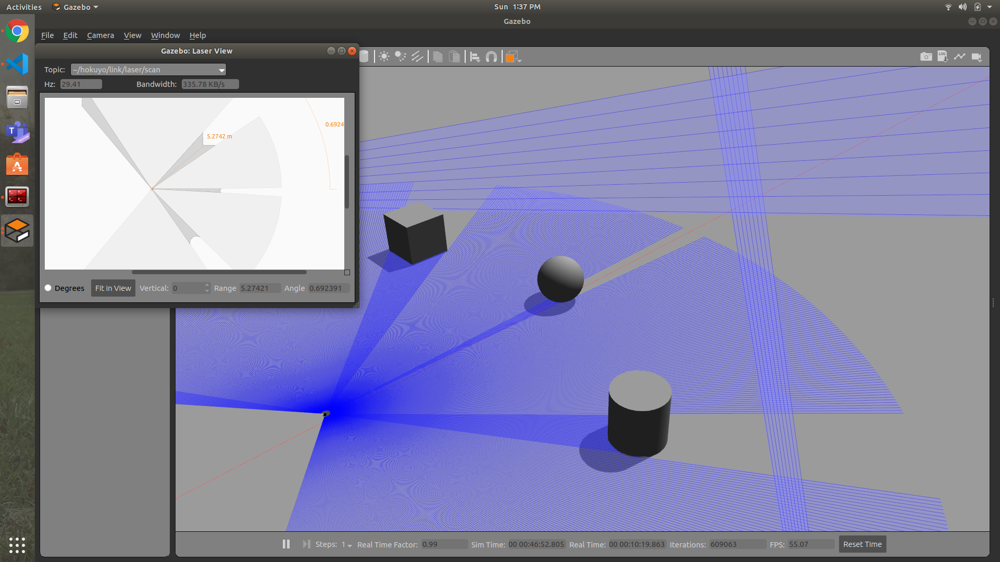
# Hokuyo Laser Scanner Perspective 4
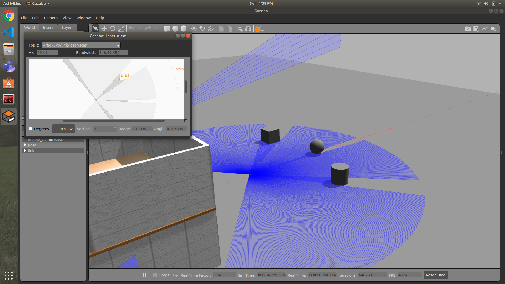